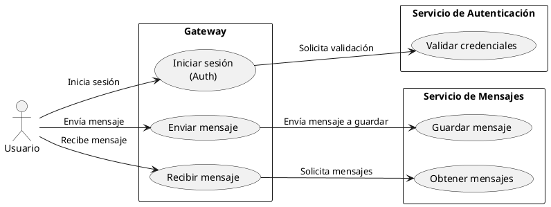

```plantuml
@startuml
left to right direction
skinparam packageStyle rectangle

actor Usuario

package "Gateway" {
  usecase "Iniciar sesión\n(Auth)" as UC1
  usecase "Enviar mensaje" as UC2
  usecase "Recibir mensaje" as UC3
}

package "Servicio de Autenticación" {
  usecase "Validar credenciales" as AuthService
}

package "Servicio de Mensajes" {
  usecase "Guardar mensaje" as MsgStore
  usecase "Obtener mensajes" as MsgRetrieve
}

' Relaciones usuario - gateway
Usuario --> UC1 : Inicia sesión
Usuario --> UC2 : Envía mensaje
Usuario --> UC3 : Recibe mensaje

' Relaciones gateway - servicios internos
UC1 --> AuthService : Solicita validación
UC2 --> MsgStore : Envía mensaje a guardar
UC3 --> MsgRetrieve : Solicita mensajes

@enduml


@startuml
[*] --> Desconectado

Desconectado --> Conectando : Usuario inicia conexión
Conectando --> Autenticando : Conexión establecida
Autenticando --> Autenticado : Credenciales válidas
Autenticando --> ErrorAutenticacion : Credenciales inválidas

ErrorAutenticacion --> Desconectado : Reintentar

Autenticado --> EnviandoMensaje : Usuario envía mensaje
Autenticado --> RecibiendoMensaje : Usuario recibe mensaje
Autenticado --> Desconectado : Usuario cierra sesión

EnviandoMensaje --> Autenticado : Mensaje enviado correctamente
EnviandoMensaje --> ErrorMensaje : Error al enviar mensaje

RecibiendoMensaje --> Autenticado : Mensaje recibido

ErrorMensaje --> EnviandoMensaje : Reintentar envío
ErrorMensaje --> Autenticado : Cancelar envío

@enduml

```

