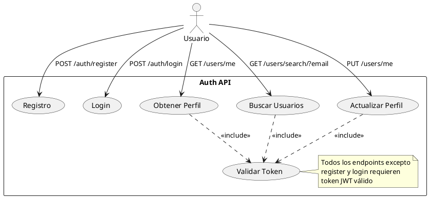

# Auth API

Microservicio de autenticación y autorización basado en FastAPI que proporciona gestión de usuarios y tokens JWT.

## 🔐 Características de Seguridad

- **Autenticación JWT**: Tokens seguros con tiempo de expiración configurable
- **Contraseñas**: Hasheadas con bcrypt
- **Validación**: Verificación de correo electrónico
- **Base de Datos**: PostgreSQL para almacenamiento persistente

## 🚀 Endpoints

### `POST /auth/register`
Registro de nuevos usuarios.

**Request:**
```json
{
    "email": "usuario@ejemplo.com",
    "password": "contraseña123"
}
```
**Response**:
```json
{
    "id": "uuid",
    "email": "usuario@ejemplo.com",
    "created_at": "2024-03-20T10:00:00"
}
```

### `POST /auth/login`
Inicio de sesión y obtención de token JWT.

**Request**:
```json
{
    "email": "usuario@ejemplo.com",
    "password": "contraseña123"
}
```
**Response**:
```json
{
    "access_token": "eyJhbGciOiJIUzI1NiIs...",
    "token_type": "bearer"
}
```
### `GET /users/me`
Obtener información del usuario actual.

**Headers**:
```json
Authorization: Bearer <token>
```
**Response**:
```json
{
    "id": "uuid",
    "email": "usuario@ejemplo.com",
    "created_at": "2024-03-20T10:00:00"
}
```
## ⚙️ Instalación y Ejecución
1. **Prerrequisitos**
    Asegúrate de tener Docker instalado en tu máquina. Puedes descargarte e instalar Docker desde su [página oficial](https://www.docker.com/).

2. **Variables de Entorno**
Crea un archivo .env:
```env
    POSTGRES_DB=auth_db
    POSTGRES_HOST=auth-db
    POSTGRES_PORT=5432
    POSTGRES_USER=auth_user
    POSTGRES_PASSWORD=auth_password
```
3. Docker Compose
```compose
    services:
    auth-db:
        image: postgres:15
        env_file:
          - .env
        ports:
          - "5432:5432"
        volumes:
          - auth-data:/var/lib/postgresql/data

    auth-api:
        image: amandasmz/auth-api:latest
        ports:
          - "8000:8000"
        depends_on:
          - auth-db
        env_file:
          - .env

    volumes:
        auth-data:
```

4. **Iniciar Servicios**

```bash
    docker-compose up -d
```
1. **Monitorización**

```bash
# Ver logs
docker logs auth-api

# Logs en tiempo real
docker logs -f auth-api
```

5. **Verificación**

    Abre un navegador web y accede a http://localhost:8000/docs. Aparecerá la documentación oficial de la api y podrás probar sus endpoints.

## 🛠️ Estructura de Archivos

auth-api/
├── app/
│   ├── __init__.py
│   ├── main.py
│   ├── models.py
│   ├── service.py
│   └── constants.py
├── requirements.txt
├── .env
├── Dockerfile
└── init_db.py

✅ Ejemplo de Uso


    📎 Notas

    La base de datos se inicializa automáticamente en el primer arranque
    Los tokens JWT expiran después de 30 minutos por defecto
    La documentación completa está disponible en /docs y /redoc

