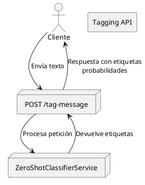

# Tagging API

Microservicio IA para etiquetado automático de mensajes utilizando *zero-shot classification* (modelo `facebook/bart-large-mnli`).

## 🔍 Umbral de Exactitud de Etiquetas

Las etiquetas son consideradas relevantes si su exactitud es mayor o igual al umbral definido en la API.

- Umbral por Defecto: 50%
Este valor se puede ajustar en el código, de acuerdo a las necesidades del negocio.

**Para cambiar esta configuración**:

Abre el archivo service.py.

Modifica la línea 49, correspondiente al umbral:

```python

    threshold = 0.5
```

Esto asegurará que solo las etiquetas con una confianza igual o superior al 50% sean incluidas en los resultados de la API.

## 🚀 Endpoints

### `GET /`
Endpoint de prueba. Devuelve un mensaje de bienvenida.

Respuesta ejemplo:
```json
{"message": "API de etiquetado automático de mensajes (zero-shot classification)"}
```

---

### `POST /tag-message`

Etiqueta automáticamente mensajes usando un modelo preentrenado.

**Request:**
```json
{
  "text": "Texto a etiquetar"
}
```

**Response:**
```json
[
    {"id": "id_etiqueta2", "name": "etiqueta2"},
    {"id": "id_etiqueta1", "name": "etiqueta1"},
  ]
```

---

## ⚙️ Instalación y Ejecución

1. **Prerrequisitos**

    Asegúrate de tener Docker instalado en tu máquina. Puedes descargarte e instalar Docker desde su [página oficial](https://www.docker.com/).

2. **Variables de entorno**

Crea un archivo .env:
```env
    POSTGRES_DB=auth_db
    POSTGRES_HOST=auth-db
    POSTGRES_PORT=5432
    POSTGRES_USER=auth_user
    POSTGRES_PASSWORD=auth_password
```

3. **Docker Compose**
   
```compose
  tagging-api:
    container_name: tagging-api
    image: tagging-api
    restart: unless-stopped
    env_file:
      - ./tagging-api/.env
    build: 
      context: ./tagging-api
    volumes:
      - ./wait-for-it.sh:/code/wait-for-it.sh
      - ./tagging-api:/code
    depends_on:
      - tagging-db
    command:
      sh -c "./wait-for-it.sh tagging-db:5432 --strict --timeout=60 -- python init_db.py && uvicorn app.main:app --host 0.0.0.0 --port 8000 --reload"
    ports:
      - 8000:8000


  tagging-db:
    image: postgres:15
    container_name: tagging-db
    restart: unless-stopped
    env_file:
      - ./tagging-api/.env
    volumes:
      - pgdata-tagging:/var/lib/postgresql/data
    ports:
      - 5432:5432

```

4. **Iniciar Servicios**

```bash
    docker-compose up -d
```
5. **Monitorización**

```bash
# Ver logs
docker logs tagging-api

# Logs en tiempo real
docker logs -f tagging-api
```

5. **Verificación**

    Abre un navegador web y accede a http://localhost:8000/docs. Aparecerá la documentación oficial de la api y podrás probar sus endpoints.

---

## 🛠️ Estructura de archivos

```
.
├── main.py
├── service.py
├── constants.py
├── models.py
└── constants.py
```

---

## ✅ Ejemplo de uso



```python
import requests

data = {
    "text": "Quiero reservar un hotel en Madrid"
}

r = requests.post("http://localhost:8002/tag-message", json=data)
print(r.json())
```

---


    📎 Notas

    El modelo se descarga automáticamente la primera vez que se ejecuta.
    La documentación completa está disponible en /docs y /redoc