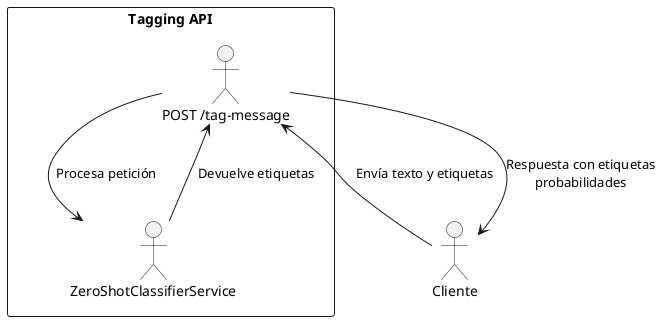

# Tagging API

Microservicio IA para etiquetado automático de mensajes utilizando *zero-shot classification* (modelo `facebook/bart-large-mnli`).

## 🔍 Umbral de Exactitud de Etiquetas

Las etiquetas son consideradas relevantes si su exactitud es mayor o igual al umbral definido en la API.

- Umbral por Defecto: 50%
Este valor se puede ajustar en el código, de acuerdo a las necesidades del negocio.

**Para cambiar esta configuración**:

Abre el archivo service.py.

Modifica la línea 49, correspondiente al umbral:

```python

    threshold = 0.5
```

Esto asegurará que solo las etiquetas con una confianza igual o superior al 50% sean incluidas en los resultados de la API.

## 🚀 Endpoints

### `GET /`
Endpoint de prueba. Devuelve un mensaje de bienvenida.

Respuesta ejemplo:
```json
{"message": "API de etiquetado automático de mensajes (zero-shot classification)"}
```

---

### `POST /tag-message`

Etiqueta automáticamente mensajes usando un modelo preentrenado.

**Request:**
```json
{
  "text": "Texto a etiquetar",
  "labels": ["etiqueta1", "etiqueta2", "etiqueta3"]
}
```

**Response:**
```json
{
  "predicted_labels": ["etiqueta2"],
  "probabilities": [
    {"label": "etiqueta2", "score": 0.82},
    {"label": "etiqueta1", "score": 0.18},
    {"label": "etiqueta3", "score": 0.05}
  ]
}
```

---

## ⚙️ Instalación y Ejecución

1. **Prerrequisitos**

    Asegúrate de tener Docker instalado en tu máquina. Puedes descargarte e instalar Docker desde su [página oficial](https://www.docker.com/).


2. **Descarga y corre el contenedor**:

    ```sh
    docker run -d --name taggerapi -p 8002:8002 amandasmz/taggerapi
    ```
3. **Verificación**

    Abre un navegador web y accede a http://localhost:8000/docs. Aparecerá la documentación oficial de la api y podrás probar sus endpoints.

---

## 🛠️ Estructura de archivos

```
.
├── main.py
├── service.py
├── constants.py
├── models.py
└── constants.py
```

---

## ✅ Ejemplo de uso



```python
import requests

data = {
    "text": "Quiero reservar un hotel en Madrid",
    "labels": ["viaje", "salud", "ocio"]
}

r = requests.post("http://localhost:8002/tag-message", json=data)
print(r.json())
```

---


    📎 Notas

    El modelo se descarga automáticamente la primera vez que se ejecuta.
    La documentación completa está disponible en /docs y /redoc