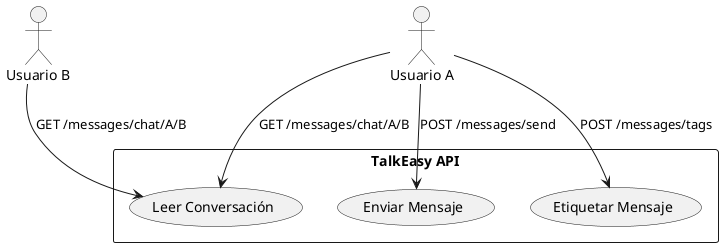

# TalkEasy API

Microservicio de mensajería de TalkEasy, desarrollado con FastAPI. Permite enviar mensajes entre usuarios, clasificarlos con etiquetas y consultar conversaciones anteriores.

## ✉️ Características Principales

- **Mensajería en Tiempo Real**: Soporte de WebSocket para comunicación instantánea
- **Mensajes Clasificables**: Etiquetas personalizadas por el usuario
- **Base de Datos Mixta**: PostgreSQL para usuarios y metadatos, MongoDB para almacenamiento eficiente de mensajes
- **Protección por Token**: Verificación JWT contra `auth-api`
- **Arquitectura Limpia**: Separación clara por dominios y responsabilidades

## 🚀 Endpoints

### `POST /messages/send`
Envía un nuevo mensaje a otro usuario.

**Request:**
```json
{
  "to_user": "uuid-del-receptor",
  "text": "Hola, ¿cómo estás?",
  "tag_id": ["id1", "id2"]
}
```

**Response:**
```json
{
  "id": "uuid-mensaje",
  "with_user_id": "uuid-emisor",
  "text": "Hola, ¿cómo estás?",
  "created_at": "2025-05-26T10:00:00",
  "tags": [{"id":"id1", "name":""}]
}
```

### `GET /messages/chat/{from_user}/{with_user}`
Devuelve todos los mensajes entre dos usuarios.

**Headers:**
```http
Authorization: Bearer <token>
```

**Response:**
```json
[
  {
    "id": "uuid1",
    "text": "Hola",
    "with_user": "uuidA",
    "created_at": "2025-05-26T10:00:00",
    "tags": []
  },
  ...
]
```

## ⚙️ Instalación y Ejecución

### 1. Prerrequisitos

Asegúrate de tener Docker y Docker Compose instalados. Puedes obtenerlos desde [docker.com](https://www.docker.com/).

### 2. Variables de Entorno

Crea un archivo `.env`:

```env
POSTGRES_DB=messages_db
POSTGRES_HOST=messages-db
POSTGRES_PORT=5432
POSTGRES_USER=messages_user
POSTGRES_PASSWORD=securepassword
```

### 3. Docker Compose

```yaml
services:
  messages-db:
    image: postgres:15
    env_file:
      - .env
    ports:
      - "5433:5432"
    volumes:
      - messages-data:/var/lib/postgresql/data

  talkeasy-api:
    image: amandasmz/talkeasy-api:latest
    ports:
      - "8001:8000"
    depends_on:
      - messages-db
    env_file:
      - .env

volumes:
  messages-data:
```

### 4. Iniciar Servicios

```bash
docker-compose up -d
```

### 5. Monitorización

```bash
# Ver logs
docker logs talkeasy-api

# Logs en tiempo real
docker logs -f talkeasy-api
```

### 6. Verificación

Abre tu navegador y accede a [http://localhost:8001/docs](http://localhost:8001/docs) para acceder a la documentación interactiva de la API.

## 🛠️ Estructura de Archivos

```
talkeasy-api/
├── api/
│   └── messages_routes.py
├── domain/
│   └── usecases.py
├── infrastructure/
│   ├── db/
│   │   ├── models_postgres.py
│   │   ├── mongo_repository.py
│   └── services/
│       └── jwt_validator.py
├── main.py
├── requirements.txt
├── Dockerfile
└── .env
```

## ✅ Diagrama de Flujo


